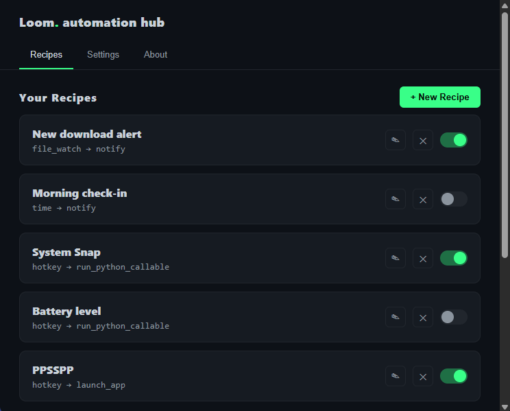

# Loom

**A personal automation hub that lives quietly in your Windows system tray.**

Loom watches for things happening on your PC — a file appearing, a time
of day, your system going idle, a hotkey, your clipboard changing, a USB
drive being plugged in — and automatically runs an action in response:
launch a script, move a file, send a notification, or run your own
custom Python through plugins. No window pops up until you ask for one.



## Download

**[⬇ Download the latest installer](../../releases/latest)** — grab
`LoomSetup.exe` from the Releases page, run it, and Loom will be in
your system tray in a few seconds. No Python installation required.

## Features

- **6 trigger types** — time of day, system idle, file watching, global
  hotkeys, clipboard changes, and USB/drive detection
- **7 built-in actions** — run a script, launch an app, move/copy/rename
  a file, show a notification, or run a custom plugin function
- **A real plugin system** — drop in your own Python, get live syntax
  validation, and pick it straight from a dropdown in the recipe builder
- **Desktop notifications** on every automation, success or failure
- **Runs on Windows startup** (optional, one click in Settings)


## Quick start (Using Loom)

1. Click **+ New Recipe**.
2. Pick a **trigger** (e.g. "Time of day") and an **action** (e.g.
   "Show notification"). The form fields change to match what each needs.
3. Fill them in — for path fields, click the **...** button to browse
   instead of typing; for a hotkey, just click the field and press your
   key combo.
4. Save. Loom keeps watching in the background, even with the dashboard
   closed — right-click the tray icon any time to reopen it.

Three demo recipes are included on first launch so you have something
to look at immediately — edit or delete them freely.

## Using the dashboard

The dashboard has three tabs:

**Recipes** — click **+ New Recipe**, pick a trigger and an action; the
form fields update to match what each needs. Required fields are checked
before saving, and if a trigger can't actually start (bad path, missing
folder, syntax error in a referenced plugin, etc.) you get the real error
back in the form. Existing recipes can be edited (pencil), deleted (✕),
or toggled on/off. Below that, **Recent Activity** logs every fire
(click **Clear** to wipe it), and **Plugins** shows every file in
`/plugins` with a health badge — click **+** to import a new plugin
via a native file picker; a broken one is validated and rejected before
it's added.

**Settings** —
- *Run Loom when Windows starts*: adds/removes Loom from your per-user
  Registry startup entry. No admin rights needed.
- *Notify on every automation*: toggles the generic "fired/failed" toast
  shown for actions other than the dedicated `notify` action. Failures
  always toast regardless of this setting.
- *Debounce window*: how many seconds to ignore a repeat trigger event
  after the last one — protects against noisy triggers (file_watch in
  particular can report two raw OS events for a single save).

**About** — what Loom is, how the trigger→action recipe model works,
and a quick-start walkthrough, for anyone new to the app.

## Extending Loom with plugins

Loom's built-in actions (`notify`, `run_script`, `launch_app`, `move_file`,
`copy_file`, `rename_file`) are generic. A plugin is where you put logic
specific to *your* work — call an API, touch a database, resize an image,
whatever — without touching Loom's core code.

```python
# plugins/my_plugin.py
def backup_project(path):
    ...
    return "done"
```

Once a plugin is in `/plugins` and valid, selecting **"Run plugin
function"** as a recipe's action shows a dropdown of every valid plugin
and its functions — pick one, optionally pass keyword arguments as JSON,
and save. Plugins are reloaded fresh from disk on every fire, so editing
one takes effect immediately without restarting Loom.

## Available triggers

| Type | Config | Notes |
|---|---|---|
| `time` | `{"time": "HH:MM"}` | fires once per day at a set time |
| `idle` | `{"minutes": 10}` | fires after N minutes of no input |
| `file_watch` | `{"folder", "event", "pattern"}` | fires on file created/modified/deleted in a folder |
| `hotkey` | `{"combo": "ctrl+alt+l"}` | global key combo, captured by pressing it (no typing needed) |
| `clipboard` | `{}` | fires whenever the clipboard content changes |
| `usb` | `{}` | fires when a new drive is mounted |

## Available actions

`run_script`, `launch_app`, `move_file`, `copy_file`, `rename_file`,
`notify`, `send_message` (stub — wire up real webhook calls), `run_python_callable`

## Credits

Built by Daniel Chifamba / NYDA Tech.
